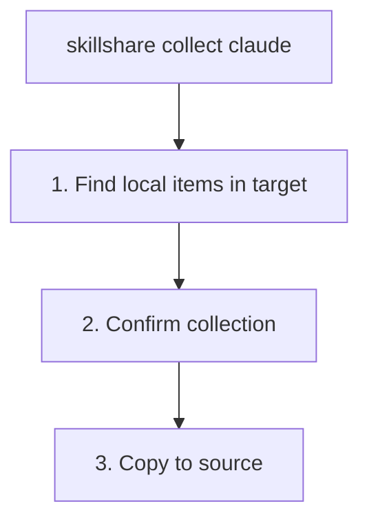

# collect

Collect local skills or agents from targets back to source.

```bash
skillshare collect claude           # From specific target
skillshare collect --all            # From all targets
skillshare collect claude --dry-run # Preview
skillshare collect agents claude    # Collect agents instead of skills
```

## When to Use

Use `collect` when you've created or edited resources directly in a target directory and want to pull them back into the source of truth:

1. Add them to your source for sharing
2. Sync them to other AI CLIs
3. Back them up with git

Examples:

- Skills: `~/.claude/skills/my-skill/`
- Agents: `~/.claude/agents/tutor.md`

## What Happens



:::tip
`.git/` directories are automatically excluded during collection. If you've git-cloned a skill repo directly into a target directory, only the skill content is copied — repository metadata stays behind.
:::

:::note
The web dashboard's **Collect** page is currently skills-only. Use the CLI for `collect agents`.
:::

## Options

| Flag | Description |
|------|-------------|
| `--all, -a` | Collect from all targets |
| `--force, -f` | Overwrite existing items in source and skip confirmation |
| `--dry-run, -n` | Preview without making changes |
| `--json` | Output as JSON (implies `--force`, skips confirmation) |

## JSON Output

```bash
skillshare collect claude --json
```

```json
{
  "pulled": ["new-skill", "another-skill"],
  "skipped": [],
  "failed": {},
  "dry_run": false,
  "duration": "0.123s"
}
```

Combine with `--dry-run` to preview without changes:

```bash
skillshare collect claude --json --dry-run
skillshare collect -p --json
skillshare collect -p agents --json
```

## Example Output

```bash
$ skillshare collect claude

Local skills found
  ℹ new-skill       [claude] ~/.claude/skills/new-skill
  ℹ another-skill   [claude] ~/.claude/skills/another-skill

Collect these skills to source? [y/N]: y

Collecting skills
  ✓ new-skill: copied to source
  ✓ another-skill: copied to source

Run 'skillshare sync' to distribute to all targets
```

## Handling Conflicts

If an item already exists in source, collection skips it by default:

```bash
$ skillshare collect claude

Collecting skills
  ⚠ my-skill: skipped (already exists in source, use --force to overwrite)

# To overwrite:
$ skillshare collect claude --force

$ skillshare collect agents claude

Collecting agents
  ⚠ tutor.md: skipped (already exists in source, use --force to overwrite)
```

## Workflow

Typical workflow after creating a skill in a target:

```bash
# 1. Create skill in Claude
# (edit ~/.claude/skills/my-new-skill/SKILL.md)

# 2. Collect to source
skillshare collect claude

# 3. Sync to all other targets
skillshare sync

# 4. Commit to git (optional)
skillshare push -m "Add my-new-skill"
```

For agents, use the agent-specific collect/sync pair:

```bash
skillshare collect agents claude
skillshare sync agents
```

## See Also

- [sync](/docs/reference/commands/sync) — Sync from source to targets
- [diff](/docs/reference/commands/diff) — See local-only skills
- [push](/docs/reference/commands/push) — Push to git remote
