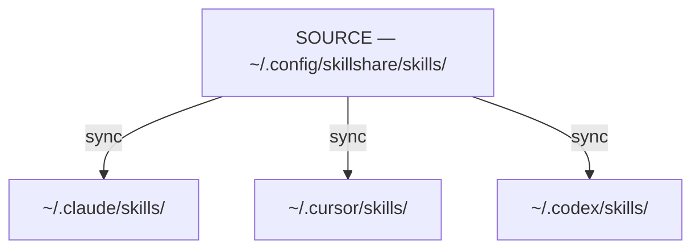
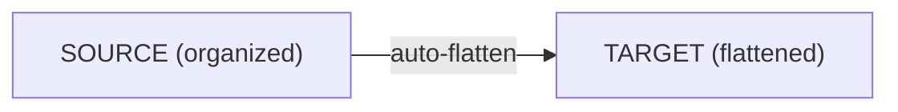

# Source & Targets

The core model behind skillshare: one source, many targets.

:::tip When does this matter?
Understanding source vs targets helps you know where to edit skills (always in source — changes reflect via symlinks), why `sync` is a separate step, and how `collect` works in the reverse direction.
:::

## The Problem

Without skillshare, you manage skills separately for each AI CLI:

```
~/.claude/skills/         # Edit here
  └── my-skill/

~/.cursor/skills/         # Copy to here
  └── my-skill/           # Now out of sync!

~/.codex/skills/          # And here
  └── my-skill/           # Also out of sync!
```

**Pain points:**
- Edits in one place don't propagate
- Skills drift apart over time
- No single source of truth

---

## The Solution

skillshare introduces a **source directory** that syncs to all **targets**:



**Benefits:**
- Edit in source → all targets update instantly
- Edit in target → changes go to source (via symlinks)
- Single source of truth

---

## Why Sync is a Separate Step

Operations like `install`, `update`, and `uninstall` only modify the **source** directory. A separate `sync` step propagates changes to all targets. This two-phase design is intentional:

**Preview before propagating** — Run `sync --dry-run` to review what will change across all targets before applying. Especially useful after `uninstall` or `--force` operations.

**Batch multiple changes** — Install 5 skills, then sync once. Without separation, each install would trigger a full scan and symlink update across all targets.

**Safe by default** — Source changes are staged, not immediately live. You stay in control of when targets update. Additionally, `uninstall` moves skills to a trash directory (kept 7 days) instead of permanently deleting them, so accidental removals are recoverable.

:::tip Exception: pull
`pull` automatically runs sync after `git pull`. Since its intent is "bring everything up to date from remote," auto-syncing matches the expected behavior.
:::

:::info When sync is NOT needed
Editing an existing skill doesn't require sync — symlinks mean changes are instantly visible in all targets. You only need sync when the set of skills changes (add, remove, rename) or when targets/modes change.
:::

---

## Source Directory

**Default location:** `~/.config/skillshare/skills/`

This is where:
- You create and edit skills
- Skills are installed to
- Git tracks changes (for cross-machine sync)

:::tip Symlinked source directories
The source directory can be a symlink — common when using dotfiles managers (GNU Stow, chezmoi, yadm). For example, `~/.config/skillshare/skills/ → ~/dotfiles/ss-skills/`. Skillshare resolves symlinks before scanning, so all commands work transparently. Chained symlinks are also supported.
:::

**Structure:**
```
~/.config/skillshare/skills/
├── my-skill/
│   └── SKILL.md
├── code-review/
│   └── SKILL.md
├── _team-skills/          # Tracked repo (underscore prefix)
│   ├── frontend/
│   │   └── ui/
│   └── backend/
│       └── api/
└── ...
```

### Organize with Folders (Auto-Flattening)

You can use folders to organize your own skills — they'll be auto-flattened when synced to targets:



**Benefits:**
- Organize skills by project, team, or category
- No manual flattening required
- AI CLIs get the flat structure they expect
- Folder names become prefixes for traceability

---

## Targets

Targets are AI CLI skill directories that skillshare syncs to.

**Common targets:**
- `~/.claude/skills/` — Claude Code
- `~/.cursor/skills/` — Cursor
- `~/.codex/skills/` — OpenAI Codex CLI
- `~/.gemini/skills/` — Gemini CLI
- And [52+ more](/docs/reference/targets/supported-targets)

**Auto-detection:** When you run `skillshare init`, it automatically detects installed AI CLIs and adds them as targets.

**Manual addition:**
```bash
skillshare target add myapp ~/.myapp/skills
```

---

## How Sync Works

### Source → Targets (`sync`)

```bash
skillshare sync
```

Creates symlinks from each target to the source:
```
~/.claude/skills/my-skill → ~/.config/skillshare/skills/my-skill
```

### Target → Source (`collect`)

```bash
skillshare collect claude
```

Collects local skills from a target back to source:
1. Finds non-symlinked skills in target
2. Copies them to source
3. Replaces with symlinks

---

## Editing Skills

Because targets are symlinked to source, you can edit from anywhere:

**Edit in source:**
```bash
$EDITOR ~/.config/skillshare/skills/my-skill/SKILL.md
# Changes visible in all targets immediately
```

**Edit in target:**
```bash
$EDITOR ~/.claude/skills/my-skill/SKILL.md
# Changes go to source (same file via symlink)
```

---

## See Also

- [sync](/docs/reference/commands/sync) — Propagate changes from source to targets
- [collect](/docs/reference/commands/collect) — Pull skills from targets back to source
- [Sync Modes](./sync-modes.md) — How files are linked (merge, copy, symlink)
- [Configuration](/docs/reference/targets/configuration) — Target config reference
